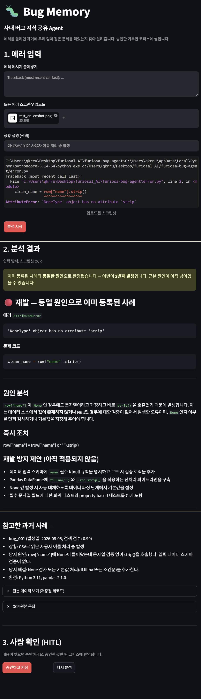

# furiosa-bug-agent

FuriosaAI RNGD 기반 **사내 버그 지식 공유 Agent** — 숭실대 자유 프로젝트 미니프로젝트

에러 스크린샷(또는 텍스트)을 넣으면, 팀이 누적한 과거 버그 기록에서 유사 사례를 찾아 원인·해결법을 정리해주는 에이전트입니다.
Claude/ChatGPT에 그 순간만 물어보면 대화가 사라지지만, 이 에이전트는 승인된 분석 결과를 팀의 검색 가능한 지식으로 계속 쌓아서 같은 에러가 재발했을 때 즉시 감지·대응합니다.

> **⚠️ 현재 실행 불가**: 이 프로젝트는 FuriosaAI RNGD 강좌 기간에 한시적으로 제공된 API 엔드포인트/키를 사용합니다. 강좌 종료 후에는 해당 API 접근이 끊겨 그대로 실행되지 않을 수 있습니다. 직접 실행해보려면 자체 FuriosaAI RNGD API 키(또는 호환 엔드포인트)를 `.env`에 새로 발급받아 넣어야 합니다.

## 아키텍처

```
스크린샷/텍스트 입력
    → OCR·입력 정규화 (app/vision.py, B)
    → 코퍼스 검색 (app/rag.py, A) — 임베딩 + 리랭커
    → Multi-Agent 분석 (app/agent.py, C) — 원인분석 + 유사사례판단(Fan-out)
         → 재발판정 → 예방조치생성 → 결과종합
    → 화면 표시 + 사람 승인(HITL) (app/ui.py, D)
    → 승인 시 app/rag.py의 upsert_bug_case()가 코퍼스에 반영
```

| 담당 | 파일 | 역할 |
|---|---|---|
| A | `app/rag.py` | 코퍼스(`app/bugs.json`) 검색·저장, 임베딩+리랭커 |
| B | `app/vision.py` | 스크린샷 OCR, 텍스트/이미지 입력 통합 |
| C | `app/agent.py` | LangGraph 기반 Multi-Agent 분석 (원인분석/재발판정/예방조치) |
| D | `app/ui.py` | Streamlit 화면, HITL 승인, LangSmith 연동 |

## 프로젝트 구조

```
furiosa-bug-agent/
├── app/            실행 코드 — agent.py / rag.py / ui.py / vision.py / bugs.json
│                   stubs.py (D 개발용 가짜 구현), test_rag.py (A 유닛 테스트)
├── docs/           모듈별 설계 메모 (AGENT.md 등)
├── assets/         테스트용 샘플 이미지
├── requirements.txt
├── README.md
└── CLAUDE.md       AI 코딩 도구 작업 규칙 (루트 고정 — 도구가 자동으로 읽음)
```

## 1. 설치

```bash
git clone https://github.com/sojjeoi/furiosa-bug-agent.git
cd furiosa-bug-agent
python -m pip install -r requirements.txt
```

> **Windows에서 `pip install`이나 `streamlit` 명령이 "command not found"라고 나오면**, PATH에 안 잡혀있는 것입니다. `pip install ...` 대신 반드시 `python -m pip install ...`처럼 `python -m`을 붙여서 실행하세요. 아래 실행 명령도 마찬가지입니다.

## 2. API 키 설정

프로젝트 루트에 `.env` 파일을 만들고 아래 내용을 채우세요. 각 모델별 키는 강좌에서 배포한 "FuriosaAI RNGD 실습 가이드" 문서에서 확인할 수 있습니다.

```
FURIOSA_VL_API_KEY=...          # Qwen3-VL-32B-Instruct (B, 화면 OCR)
FURIOSA_LLM_API_KEY=...         # GPT-OSS-120B (C, 분석)
FURIOSA_EMBEDDING_API_KEY=...   # Qwen3-Embedding-8B (A, 검색)
FURIOSA_RERANKER_API_KEY=...    # Qwen3-Reranker-8B (A, 검색)
```

**(선택) LangSmith 추적**: 실행 과정을 [smith.langchain.com](https://smith.langchain.com)에서 시각적으로 보고 싶다면 아래 줄을 추가하세요. 없어도 앱은 정상 작동합니다.

```
LANGSMITH_API_KEY=...
```

`.env`는 `.gitignore`에 포함되어 있어 커밋되지 않습니다. **API 키를 코드나 GitHub에 절대 직접 올리지 마세요.**

## 3. 실행

```bash
python -m streamlit run app/ui.py
```

브라우저가 자동으로 열립니다. 에러 메시지를 텍스트로 붙여넣거나 스크린샷을 업로드한 뒤 **[분석 시작]**을 누르면 됩니다. 분석 결과를 확인하고 **[승인하고 저장]**을 눌러야만 팀 코퍼스(`app/bugs.json`)에 반영됩니다.

> 첫 분석은 여러 LLM 호출이 순차적으로 이어져서 다소 시간이 걸립니다(정상 동작입니다 — LangSmith 트레이스에서 각 단계 소요 시간을 확인할 수 있습니다).

## 4. 데모 시나리오

1. **신규 사례**: 코퍼스에 없는 새 에러 입력 → `신규` 판정 확인
2. **재발 감지**: 방금 승인한 것과 동일한 에러를 다시 입력 → `기존 사례와 동일한 원인으로 재발` 경고와 함께 발생 횟수가 올라가는지 확인

### 실행 화면 예시

스크린샷 업로드 → 재발 감지 → 원인·조치·과거 사례 → 승인까지 이어지는 실제 화면입니다.



## Non-goals (이번 스코프에서 하지 않는 것)

- 실제 Slack/Notion 채널 연동, 사용자 인증, 여러 프로젝트/조직 동시 지원
- 예방 조치의 자동 적용·자동 검증(테스트 실행 등) — 제안까지만 하고 실제 적용은 사람이 수동으로 함
- 자동 민감정보 마스킹 — 업로드 전 육안 확인 원칙으로 대체
